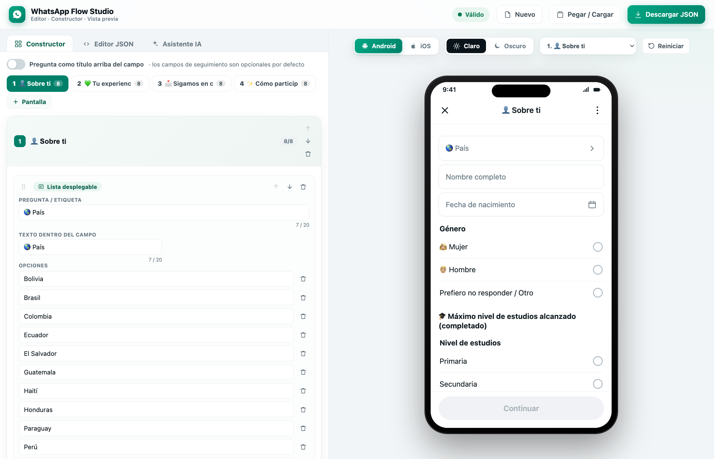
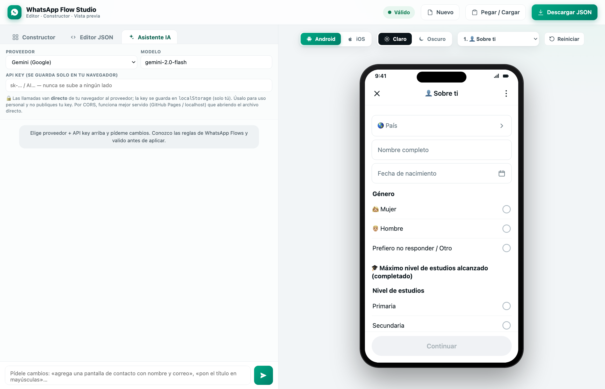
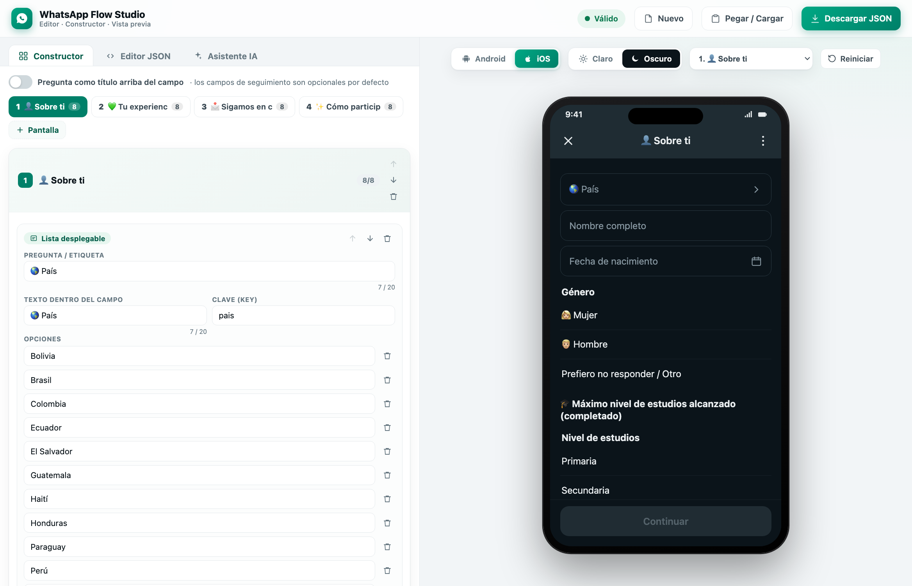

# 💬 WhatsApp Flow Studio

**Editor, constructor visual y vista previa de [WhatsApp Flows](https://developers.facebook.com/docs/whatsapp/flows) — en un solo archivo HTML, sin dependencias, 100 % offline.**

Diseña formularios nativos de WhatsApp sin pelear con el constructor de Meta (que además no te deja editar lo ya creado). Construye visualmente, edita el JSON en vivo, y **míralo tal cual se verá en WhatsApp** con toggles de **Android / iOS** y **claro / oscuro** — incluyendo simulación de llenado y envío.

### ▶️ Pruébalo ahora, gratis y sin instalar nada → **[abrir WhatsApp Flow Studio](https://angelberrios23.github.io/whatsapp-flow-studio/)**

> **Funciona con o sin IA.** El constructor, el editor y la vista previa son 100 % gratis y **no necesitan ninguna API**. El **Asistente IA es opcional**: si conectas tu propia key (Gemini / Claude / OpenAI / Kimi / *custom*), las llamadas van **directo de tu navegador al proveedor** — **tus datos y tu API key NO pasan por ningún servidor, ni el mío ni el de nadie.** Todo corre en tu navegador (es un solo archivo HTML); la key se guarda solo en tu `localStorage`.



## ✨ Qué hace

- **🧩 Constructor visual con muros de seguridad** — agrega pantallas y elementos (título, párrafo, respuesta corta, correo, teléfono, fecha, opción única/múltiple, lista desplegable, casilla, imagen, separador), **reordena arrastrando** (drag & drop) y edita **una pantalla a la vez** (navegador de pantallas). Cada campo tiene **límite de caracteres real de Meta** (contador `10/20` y tope de escritura) y cada pantalla su **contador de elementos** — no te deja crear algo que Meta rechazaría. Los **nombres de campos y de pantallas se autogeneran** sin errores (nunca ids inválidos). Los **saltos de lógica** se arman con menús: *“si responde [opción] → ir a [pantalla]”*. Genera el Flow JSON válido automáticamente.
- **🤖 Asistente IA integrado** — conecta **Gemini, Claude, OpenAI, Kimi o un endpoint custom** (OpenAI-compat) con tu propia API key (guardada solo en tu navegador) y pídele cambios en lenguaje natural (“agrega una pantalla de contacto con nombre y correo”). El asistente **conoce las reglas de WhatsApp Flows** y el resultado se **valida antes de aplicarse**: si algo rompería el flow, no se aplica y puede pedir corrección.
- **📝 Editor JSON en vivo** — pega o edita el JSON y la vista previa se actualiza al instante. Formatea, copia y valida.
- **📱 Vista previa fiel** — se ve como WhatsApp real: **Android / iOS**, **claro / oscuro**, header, campos, radios, casillas, hojas de selección y botón inferior.
- **▶️ Simula llenado y envío** — llena el formulario, navega entre pantallas (los `If`/saltos se evalúan en vivo) y al enviar muestra **el payload exacto que recibiría tu webhook / n8n**.
- **✅ Validación en vivo** — detecta lo que rompe la importación en Meta: `id` de pantalla inválidos (solo letras/`_`), footer faltante en terminal, emojis en el botón, referencias rotas, límites de caracteres, etc.





> **🔒 Sobre las API keys:** el Asistente IA llama al proveedor **directamente desde tu navegador**; la key se guarda en `localStorage` (solo en tu equipo) y **nunca** se sube a este repo ni a ningún servidor. Úsalo para uso personal y no publiques tu key. Por CORS, funciona mejor servido (GitHub Pages / localhost).

## 🚀 Uso

**Opción 1 — local:** descarga `index.html` y ábrelo con doble clic en tu navegador. Eso es todo.

**Opción 2 — en línea (ya publicado):** ábrelo y úsalo → **https://angelberrios23.github.io/whatsapp-flow-studio/** · Para tu propia copia: haz *fork* y activa *Settings → Pages → Deploy from branch: `main` (raíz)*.

Dentro de la app:
- **Constructor** — arma tu flow con clics. Se genera el JSON solo.
- **Editor JSON** — pega un flow existente (o edítalo). “Importar al constructor” lo carga para editar visualmente.
- **Pegar / Cargar** — modal para pegar texto o soltar un archivo `.json`.
- **Descargar JSON** — baja el `flow.json` listo para pegar en el **Administrador de WhatsApp → Flows → Editar JSON**.

Parámetros de URL para abrir en un estado concreto:
`index.html?platform=ios&theme=dark`

## 📂 Contenido

```
index.html                        La app completa (un solo archivo)
examples/encuesta-egresados.json  Flow de ejemplo (encuesta, 4 pantallas)
screenshots/                      Imágenes para este README
skill/                            Skill de Claude Code: build_flow.py, validate_flow.py,
                                  SKILL.md, referencias y ejemplos (ver abajo)
```

## 🧠 Cómo importar el flow en WhatsApp

1. **business.facebook.com → Administrador de WhatsApp → Flows → Crear**.
2. En el editor: **⋯ → Editar JSON**, borra el ejemplo y pega tu `flow.json`.
3. **Guardar → Vista previa → Publicar.**

## ⚙️ Detalles técnicos

- Un único `index.html`: HTML + CSS + JS vanilla. Sin build, sin npm, sin CDN.
- El generador `spec → Flow JSON` maneja lo tedioso y propenso a errores: nombres únicos, claves de payload, reenvío acumulado de datos entre pantallas, declaraciones `data`, saltos de lógica (`If` con footer en ambas ramas) e `id` de pantalla válidos.
- Flow JSON objetivo: **v7.3**. Genera flows **estáticos** (`navigate` + `complete`); para flows con *endpoint* (`data_exchange`, ideal para disponibilidad tipo booking) necesitas además un servidor con cifrado — fuera del alcance de esta herramienta.

## 🧩 Skill de Claude Code incluida (carpeta `skill/`)

Este repo incluye la **skill de [Claude Code](https://claude.com/claude-code)** con la que se construyó todo. El **mismo motor de reglas** que usa el Asistente IA de la app vive aquí, más herramientas de línea de comandos:

- `skill/scripts/build_flow.py` — genera Flow JSON válido desde una spec compacta (nombres únicos, claves de payload, reenvío de datos entre pantallas, saltos de lógica e `id` válidos).
- `skill/scripts/validate_flow.py` — valida **cualquier** Flow JSON (estructura + límites de Meta) antes de importarlo. Probado contra decenas de flows reales sin falsos errores.
- `skill/SKILL.md` + `skill/references/` — toda la documentación de reglas, componentes, límites de caracteres y errores comunes de WhatsApp Flows.

**Instalar la skill:** copia la carpeta a `~/.claude/skills/whatsapp-flow/` y en Claude Code escribe `/whatsapp-flow`.

> 🧠 **El Asistente IA del navegador no construye a ciegas ni rehace todo:** su *system prompt* lleva estas mismas reglas, edita **solo lo que pides** (edición quirúrgica) y su salida **pasa por el validador** antes de aplicarse.

## 📄 Licencia

MIT — úsalo, modifícalo y compártelo libremente.

---

Hecho con ❤️ para quienes crean formularios en WhatsApp.
